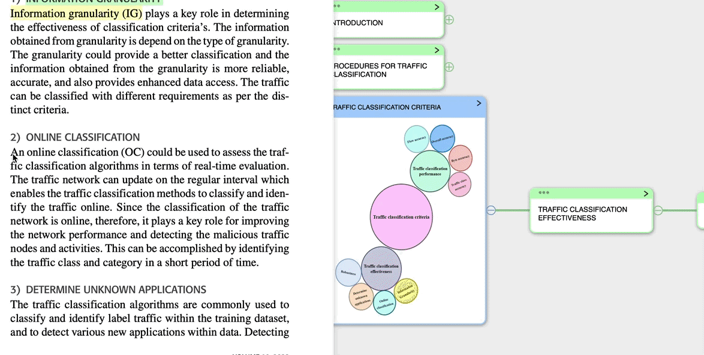
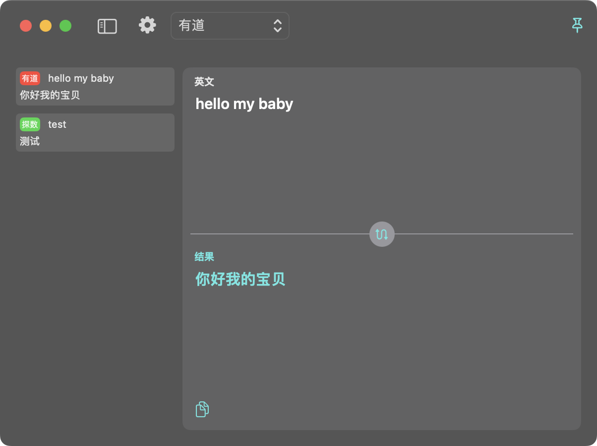

#  MarginNote 翻译插件

## 1. 数据来源

MarginNote 使用 [ReResearch](https://bbs.marginnote.com.cn/t/topic/7069/5) 插件通过 url 调用发送给该插件。

## 2. 翻译

内容捕获后，调用翻译 API 翻译即可。

已经实现的API：

* [探数](https://www.tanshuapi.com/market/detail-98?show_type=2)
* [有道](https://ai.youdao.com/DOCSIRMA/html/trans/api/wbfy/index.html)

## 3. 界面

* 左侧显示历史记录；
* 右侧翻译参照 iPhone 的翻译软件。
* 标题栏可以进入设置页面、选择翻译API、将窗口置顶等。
